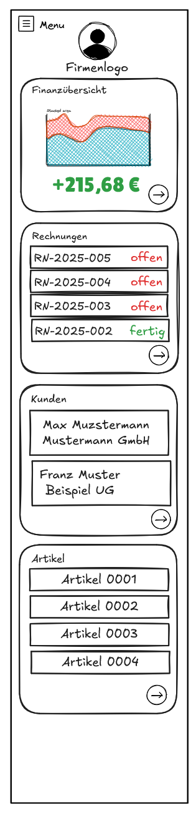

# Dashboard – Firmenansicht (Mockup)

Dieses Mockup zeigt das zentrale Dashboard für eine ausgewählte Firma innerhalb der App **„Meine Buchhaltung“**. Die Ansicht erscheint direkt nach der Firmenauswahl und dient als Überblick über den aktuellen Stand der Buchhaltung.

## 🎯 Ziele der Ansicht

- Übersicht über Finanzstatus, offene Rechnungen, Kunden und Artikel
- Schneller Einstieg in relevante Bereiche
- Visuelle Darstellung zur besseren Orientierung

## 🧱 Aufbau des Dashboards

---

### 🟦 Kopfbereich

- 📇 **Menü-Button (Hamburger)**: Öffnet Navigation oder Seitendrawer
- 🖼️ **Firmenlogo**: Optional individualisierbar pro Firma
- 🏷️ **Firmenname** (nicht explizit, aber denkbar zur Ergänzung)

---

### 📊 Finanzübersicht

- Diagramm mit Einnahmen/Ausgaben-Verlauf (Mock)
- Nettogewinn/Saldo prominent angezeigt (z. B. `+215,68 €`)
- Klick auf das Widget → detaillierte Finanzanalyse

---

### 🧾 Rechnungen

- Liste der letzten Rechnungen (z. B. `RN-2025-005`)
- Status farblich markiert:
  - 🔴 **offen**
  - ✅ **fertig**
- Pfeil unten: Weiterleitung zur vollständigen Rechnungsübersicht

---

### 👥 Kunden

- Liste der zuletzt verwendeten oder wichtigsten Kunden
- Name + Firmenname (z. B. „Max Mustermann – Mustermann GmbH“)
- Pfeil: führt zur Kundenübersicht oder -suche

---

### 📦 Artikel

- Liste der zuletzt verwendeten Artikel
- Anzeige über Artikelnummer (z. B. `Artikel 0001`)
- Pfeil: führt zur Artikelverwaltung