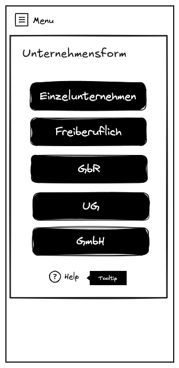
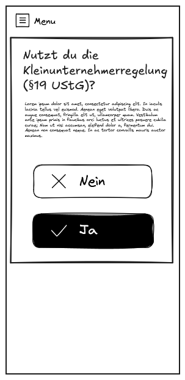
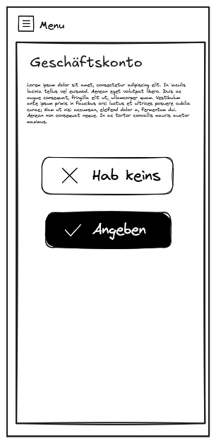
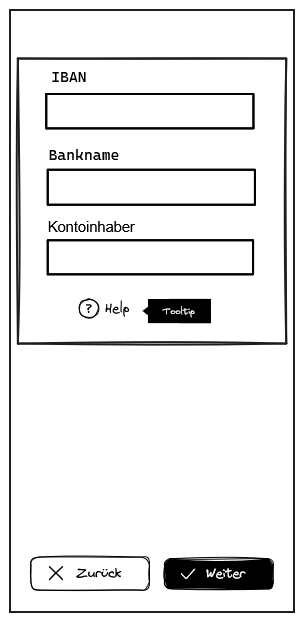
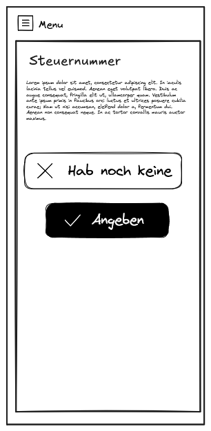
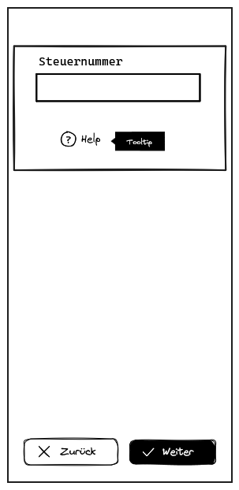
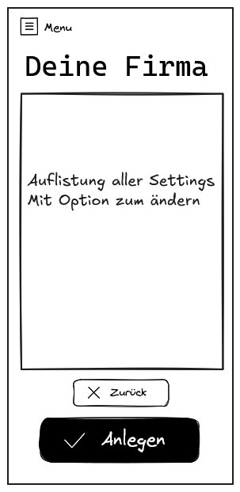

# Neue Firma anlegen – Wizard (Mockup)

Dieses Mockup zeigt den Schritt-für-Schritt-Prozess zur Anlage einer neuen Firma in der App **„Meine Buchhaltung“**. Der Wizard führt Nutzer:innen durch alle nötigen Angaben in zwei übersichtlichen Formularseiten.

---

## 🎯 Ziele des Wizards

- Einfache und verständliche Firmenerfassung
- Reduktion der Komplexität durch Aufteilung in Schritte
- Vorbereitung auf spätere Erweiterungen (z. B. Steuer- oder Backup-Daten)

---

## 🧱 Aufbau des Formular-Wizards

---

### 🟦 Formularseite 1 – Grunddaten

**Ziel:** Die wichtigsten Informationen zur neuen Firma erfassen.

| Feld | Beschreibung |
|------|--------------|
| Unternehmensname | Name des Gewerbes oder der Firma |
| Vorname & Nachname | Ansprechperson bzw. Eigentümer:in |
| Logo | Optionales Firmenlogo (Upload / Auswahl) |
| Weiter-Button | Navigiert zur Adressseite |

---

### 🟨 Formularseite 2 – Adressdaten

**Ziel:** Erfassung der Adresse, die später auch auf Rechnungen erscheinen kann.

| Feld | Beschreibung |
|------|--------------|
| Straße | z. B. Musterstraße |
| Hausnummer | z. B. 1a |
| Stadt | z. B. Musterstadt |
| PLZ | z. B. 11111 |
| Land | Dropdown oder Textfeld, Standard = Deutschland |
| Weiter-Button | Abschließen oder nächsten Schritt starten |

### 🟨 Formularseite 3

| Option            | Beschreibung                                        |
| ----------------- | --------------------------------------------------- |
| Einzelunternehmen | Klassische Form für Selbstständige                  |
| Freiberuflich     | Für Berufe wie Designer\:innen, Coaches, etc.       |
| GbR               | Gesellschaft bürgerlichen Rechts – mehrere Personen |
| UG / GmbH         | Kapitalgesellschaften mit Haftungsbeschränkung      |

### 🟨 Formularseite 4

| Element     | Beschreibung                                |
| ----------- | ------------------------------------------- |
| Frage       | „Nutzt du die Kleinunternehmerregelung?“    |
| Auswahl     | Ja / Nein                                   |
| Hinweistext | Erklärung der Regelung (Umsatzgrenzen etc.) |

### 🟨 Formularseite 5

| Auswahl     | Bedeutung                               |
| ----------- | --------------------------------------- |
| „Hab keins“ | Nutzer\:in kann später ergänzen         |
| „Angeben“   | Leitet weiter zu Eingabemaske (Seite 6) |

### 🟨 Formularseite 6

| Feld         | Beschreibung                         |
| ------------ | ------------------------------------ |
| IBAN         | Für automatische Zahlungsverknüpfung |
| Bankname     | Erkennung & Darstellung in der App   |
| Kontoinhaber | Optional, zur Identifikation         |

### 🟨 Formularseite 7

| Feld         | Beschreibung                                        |
| ------------ | --------------------------------------------------- |
| Steuernummer | Textfeld, Eingabe validierbar (z. B. Formatprüfung) |

### 🟨 Formularseite 8

| Feld         | Beschreibung                                        |
| ------------ | --------------------------------------------------- |
| Steuernummer | Textfeld, Eingabe validierbar (z. B. Formatprüfung) |

### 🟨 Formularseite 9

| Inhalt    | Beschreibung                                       |
| --------- | -------------------------------------------------- |
| Übersicht | Alle Angaben in Listenform                         |
| Buttons   | „Zurück“ zum Bearbeiten, „Anlegen“ zur Bestätigung |

