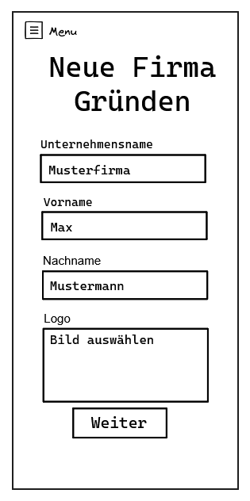
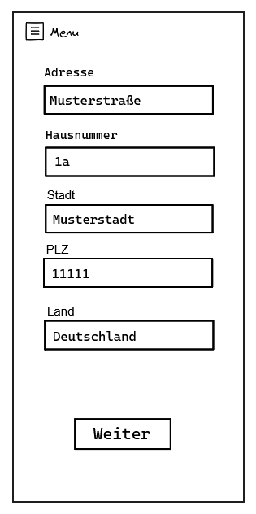

# Neue Firma anlegen – Wizard (Mockup)

Dieses Mockup zeigt den Schritt-für-Schritt-Prozess zur Anlage einer neuen Firma in der App **„Meine Buchhaltung“**. Der Wizard führt Nutzer:innen durch alle nötigen Angaben in zwei übersichtlichen Formularseiten.

---

## 🎯 Ziele des Wizards

- Einfache und verständliche Firmenerfassung
- Reduktion der Komplexität durch Aufteilung in Schritte
- Vorbereitung auf spätere Erweiterungen (z. B. Steuer- oder Backup-Daten)

---

## 🧱 Aufbau des Formular-Wizards

### Seite 1

### Seite 2

---

### 🟦 Formularseite 1 – Grunddaten

**Ziel:** Die wichtigsten Informationen zur neuen Firma erfassen.

| Feld | Beschreibung |
|------|--------------|
| Unternehmensname | Name des Gewerbes oder der Firma |
| Vorname & Nachname | Ansprechperson bzw. Eigentümer:in |
| Logo | Optionales Firmenlogo (Upload / Auswahl) |
| Weiter-Button | Navigiert zur Adressseite |

---

### 🟨 Formularseite 2 – Adressdaten

**Ziel:** Erfassung der Adresse, die später auch auf Rechnungen erscheinen kann.

| Feld | Beschreibung |
|------|--------------|
| Straße | z. B. Musterstraße |
| Hausnummer | z. B. 1a |
| Stadt | z. B. Musterstadt |
| PLZ | z. B. 11111 |
| Land | Dropdown oder Textfeld, Standard = Deutschland |
| Weiter-Button | Abschließen oder nächsten Schritt starten |

