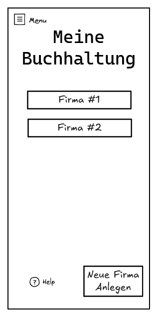

# Startseite – Firmenauswahl (Mockup)

Dieses Mockup zeigt die erste Seite der App **„Meine Buchhaltung“**, direkt nach dem App-Start. 

Hier wählt die Nutzer:in aus, mit welcher Firma gearbeitet werden soll – oder legt bei Bedarf eine neue Firma an.

## 🎯 Zweck der Seite

- Einstiegspunkt in die Buchhaltungs-App
- Übersicht aller gespeicherten Firmenprofile
- Möglichkeit, neue Firmen zu erstellen oder bestehende zu importieren
- Zukünftige Verwaltung von Backups

## 🧱 Aufbau des Screens

### 🔹 Firmenliste

- Zeigt alle lokal gespeicherten Firmen (Name, optional Logo oder Adresse)
- Klick → Navigiert in die Buchhaltungsoberfläche dieser Firma

### ➕ Neue Firma anlegen

- Über Button soll Anlege Menü geöffnet werden
- Startet den geführten Wizard zur Firmenregistrierung

### ⬇️ Firma importieren (geplant)

- Wird später Backup-Import aus Datei oder Cloud ermöglichen

### ☁️ Backup / Synchronisierung (geplant)

- Button oder Menüpunkt für zukünftige Sicherungsfunktionen
- Geplant: Export/Import, Cloud-Sync

